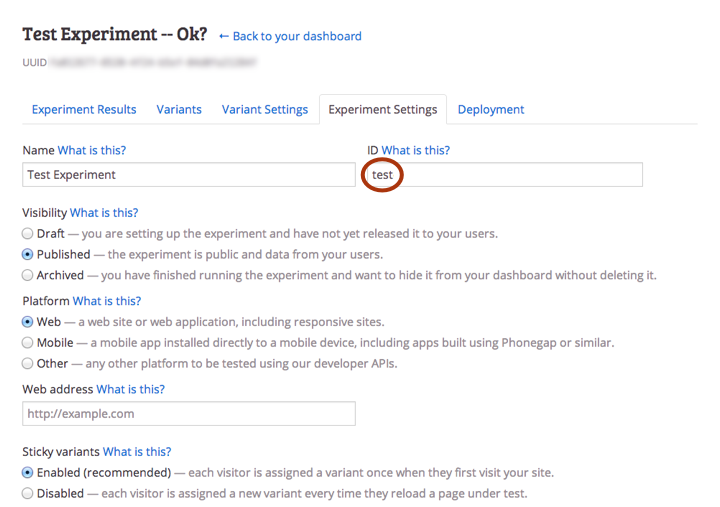
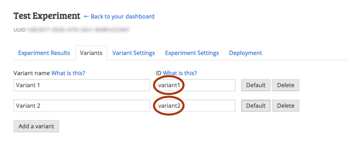

The call to `Myna.init`, `Myna.initLocal`, or `Myna.initRemote` will asynchronously initialize Myna and call your `success` callback, passing you a *client* object. This object is also published as `window.Myna.client`:

~~~ js
console.log(Myna.client);
// => Client { ... }
~~~

# Suggesting variants

You can ask Myna to *suggest* a variant from on of your experiments using the `suggest` method. This uses the latest experiment data to select the optimal variant to display to this user:

~~~ js
Myna.client.suggest(
  experimentId,
  function successCallback(variant, firstTimeSuggested) {
    // Set up the page for the relevant variant...
  },
  function errorCallback() {
    // Something went wrong - fall back to a default variant...
  }
);
~~~

You can see and edit the ID of your experiment on the *Experiment Settings* page of your dashboard:

Myna calls `successCallback` with two arguements: a `Variant` object and a `boolean` saying whether the variant is being suggested for the first time (as opposed to being loaded from a cookie). You can check which variant Myna is suggesting using its `id` field:

~~~ js
Myna.client.suggest(
  experimentId,
  function successCallback(variant, firstTimeSuggested) {
    switch(variant.id) {
      case "variant1":
        // Set up the page and conversion goals for variant 1...
        break;
      case "variant2":
        // Set up the page and conversion goals for variant 2...
        break;
      // And so on...
    }
  }
);
~~~

You can see and edit the ID for each of your variants on the *Variants* page of your Dashboard:

Myna automatically takes care of repeated calls to `suggest`. The behaviour of the method follows the settings from your Dashboard. If your experiment is set up with *sticky* variants (the default), `suggest` will always return the same variant and Myna will only record one view for the experiment.

# Rewarding variants

If a user converts, you can reward the suggested variant using the client's `reward` method:

~~~ js
Myna.client.reward(experimentId);
~~~

Myna automatically takes care of repeated calls to `reward`.
