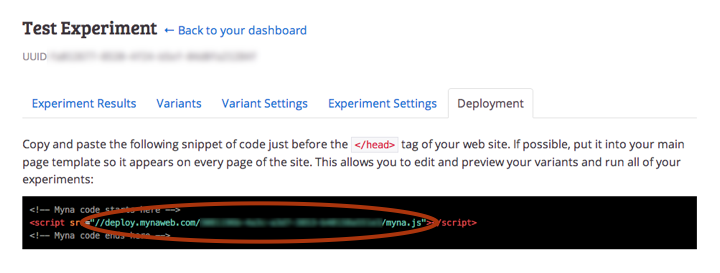

# Grabbing the client

You can grab the Myna JS script from the [Github repository](https://github.com/myna/myna-js/) or directly from the Myna CDN. There are two versions to choose from:

 - The basic *myna* client, which supports running experiments using Javascript code:

    - [http://cdn.mynaweb.com/clients/myna-2.latest.js](http://cdn.mynaweb.com/clients/myna-2.latest.js) (~60k, unminified)
    - [http://cdn.mynaweb.com/clients/myna-2.latest.min.js](http://cdn.mynaweb.com/clients/myna-2.latest.min.js) (~30k, minified)

 - The *myna-html* client, which supports all the features of the basic client plus [declarative data-binding]() tags and the [Myna inspector]():

    - [http://cdn.mynaweb.com/clients/myna-2.latest.js](http://cdn.mynaweb.com/clients/myna-html-2.latest.js) (~80k, unminified)
    - [http://cdn.mynaweb.com/clients/myna-2.latest.min.js](http://cdn.mynaweb.com/clients/myna-html-2.latest.min.js) (~44k, minified)

# Basic setup

Add the script to the bottom of the `<head>` or `<body>` or your page:

~~~ html
<!DOCTYPE html>

<html>
  <head>
    <!-- ... -->
    
  </head>
  <body>
    <!-- ... -->
  </body>
</html>
~~~

## Using jQuery

If you're using *myna-html* you will need to include jQuery 1.9.x *before* you include Myna:

~~~ html
<!DOCTYPE html>

<html>
  <head>
    <!-- ... -->
    
    
  </head>
  <body>
    <!-- ... -->
  </body>
</html>
~~~

## Deployment URL

One final step -- you need to call the `Myna.initRemote` function and pass it a *deployment URL*:

~~~ html

~~~

Deployment URLs can be found on the *Deployment* tab of any experiment on your Dashboard -- take the `.js` URL and replace the extension with `.json`:

